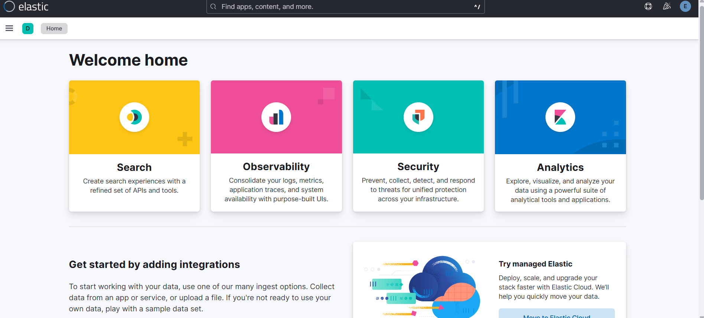
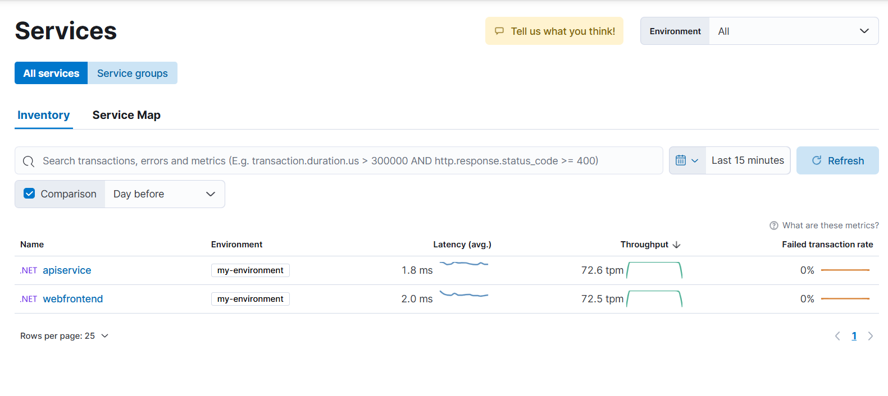

### Elasticsearch Conference Speaking Outline

#### Introduction
- **Introduction to Speaker**
  - Brief personal introduction
  - Background in Kubernetes, .NET, and cloud services
- **Session Overview**
  - What will be covered: Setting up Elasticsearch, APM Server, and Kibana on Rancher Desktop
  - Importance of monitoring and logging in modern applications
  - Benefits of using Elasticsearch in a multi-cloud environment

#### Environment Setup
- **Mention Rancher Desktop**
  - Overview of Rancher Desktop and its capabilities
  - Note that Rancher Desktop will be pre-installed and running for the demonstration

#### Installing Elastic Operators
- **Introduction to Elastic Operators**
  - Explanation of Kubernetes Operators and its role
- **Running Helm Command**
  - Demonstration of running the Helm command to deploy Elastic Operators and CRDs
  - Verification of deployment

#### Running Elasticsearch, APM Server, and Kibana
- **Deploying Services via Helm**
  - Running Helm commands to deploy Elasticsearch, APM Server, and Kibana
  - Verifying deployments and basic configurations

#### Integrating .NET Aspire with Elastic APM
- **Overview of .NET Aspire Project**
  - Brief explanation of .NET Aspire and its relevance
- **Configuring OLTP Settings**
  - Configuring the .NET application to point to the APM Server
  - Explanation of the `ElasticApm` settings

#### Demonstrating Extension Method
- **Pre-built Extension Method**
  - Showing an easy extension method to add the necessary environment variables
  - Explanation of how the extension method simplifies configuration
  - Example code snippet for the extension method

```csharp
public static class ElasticApmExtensions
{
    public static IProjectBuilder WithElasticApm(this IProjectBuilder builder, string serviceName, string environment)
    {
        return builder
            .WithEnvironment("ElasticApm__ServerUrls", "https://localhost:55822")
            .WithEnvironment("ElasticApm__SecretToken", "k711M3s1AN2dyXR4YbYiy668")
            .WithEnvironment("ElasticApm__ServiceName", serviceName)
            .WithEnvironment("ElasticApm__Environment", environment)
            .WithEnvironment("ElasticApm__VerifyServerCert", "false");
    }
}

var builder = DistributedApplication.CreateBuilder(args);

var apiService = builder.AddProject<Projects.AspireToElastic_ApiService>("apiservice");

builder.AddProject<Projects.AspireToElastic_Web>("webfrontend")
    .WithExternalHttpEndpoints()
    .WithReference(apiService)
    .WithElasticApm("webfrontend", "my-environment");

builder.Build().Run();
```


Integrating Quarkus with OpenTelemetry and Elastic APM
Overview of Quarkus Project
Brief explanation of Quarkus and its relevance
Configuring OpenTelemetry in Quarkus
Setting up the application.properties file with the necessary configurations
Explanation of the key configuration values
Example configuration:
properties
Copy code
quarkus.application.name=myservice 
quarkus.otel.exporter.otlp.traces.endpoint=http://localhost:4317 
quarkus.otel.exporter.otlp.traces.headers=authorization=Bearer my_secret

#### Viewing Metrics in Kibana
- **Accessing Kibana UI**
  - Navigating to the Kibana interface
  - Overview of the Kibana dashboard



- **Analyzing Metrics**
  - Viewing logs and metrics collected by Elastic APM
  - Demonstration of useful Kibana features for data visualization and analysis



#### Review and Q&A
- **Recap of the Session**
  - Summary of key points covered
  - Highlight the flexibility and advantages of using Elastic in a multi-cloud setup
- **Q&A Session**
  - Open floor for audience questions
  - Addressing common challenges and providing additional resources

#### Conclusion
- **Final Thoughts**
  - Importance of effective monitoring and logging in modern applications
  - Encouragement to explore and leverage Elasticsearch and Elastic APM further
- **Thank You and Contact Information**
  - Thank the audience for their time
  - Provide contact details for further questions or networking

